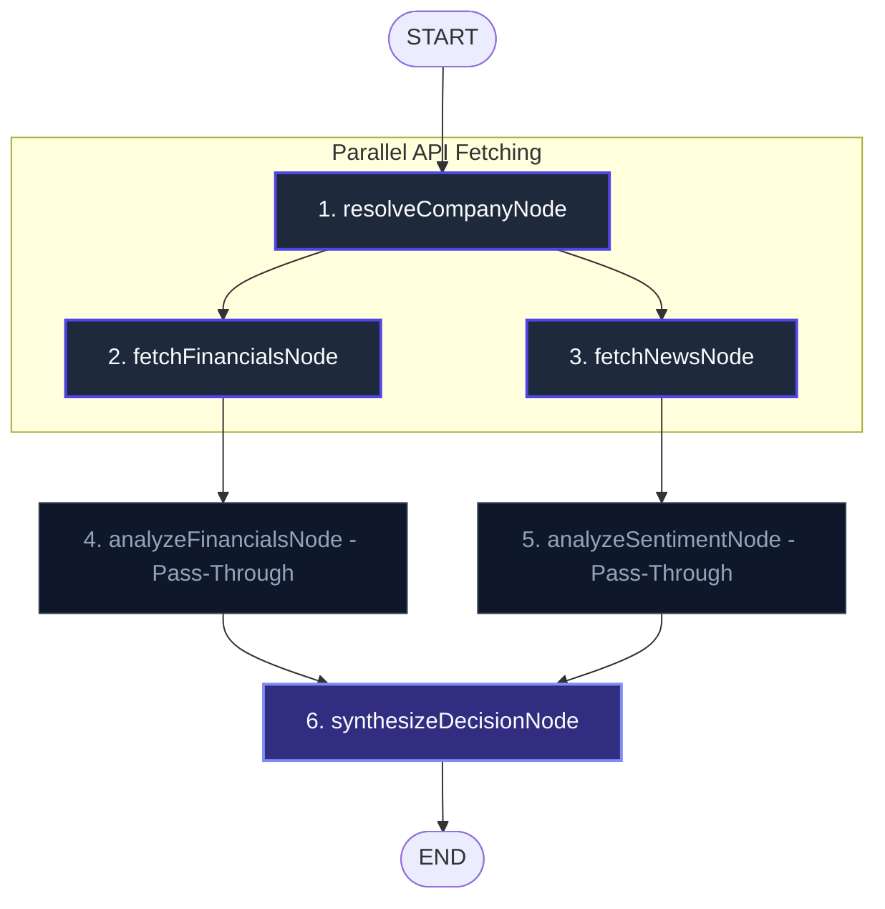

# AI Investment Research Agent

An autonomous, multi-agent financial research dashboard powered by **LangGraph**, **React**, **Tailwind CSS**, and **Express**. The system performs real-time fundamental financial analysis and news sentiment tracking to synthesize institutional-grade investment decisions.

---

## 🏗️ System Architecture & Workflow

The backend utilizes **LangGraph** (`StateGraph`) to manage stateful, multi-step agent actions. It is structured to run as many steps as possible via deterministic APIs and combine all cognitive reasoning into a **single, final LLM call** to reduce latency and prevent API rate-limiting.



### 1. Company Ticker Resolution (`resolveCompanyNode`)
- Resolves search queries (e.g. `"Tesla"`) to public stock symbols.
- Hits **Finnhub's Symbol Lookup API** first, falling back to **FMP's stable search endpoints** (symbol & name searches) if unconfigured or restricted.
- **US Market Prioritization**: Filters search results to prioritize standard tickers (symbols without dots, like `TSLA` instead of `TSLA.NE`), preventing subscription restriction issues (`402/403` errors) common with international exchanges.

### 2. Parallel API Data Fetching (`fetchFinancialsNode` & `fetchNewsNode`)
- Runs in parallel using `Promise.all`:
  - **Financial Fundamentals**: Fetches real-time company profile and key valuation metrics (current price, market cap, return on assets, return on equity, etc.) from **FMP (Financial Modeling Prep) stable APIs**.
  - **Market News**: Searches for the latest news articles using **Tavily Search API** with a dedicated `"news"` filter to retrieve publication dates, headlines, and content snippets.

### 3. Pass-Through Nodes (`analyzeFinancialsNode` & `analyzeSentimentNode`)
- Set up as deterministic pass-through nodes. They forward the raw data to state variables without initiating separate LLM calls, saving API costs and reducing request concurrency.

### 4. Consolidated Analysis & Decision Synthesis (`synthesizeDecisionNode`)
- Performs the **single LLM call** for the entire workflow.
- Receives the raw financials, news snippets, and metadata.
- Uses `ChatOpenAI` with `.withStructuredOutput(FullAnalysisSchema)` to analyze fundamentals, score financial health, determine news sentiment themes, choose a final recommendation (`INVEST`, `PASS`, or `WATCH`), and outline key factors with detailed reasoning.

---

## ⚡ Key Optimizations

### 🕵️‍♂️ Automatic API Key Routing
If a Google Gemini API key (prefixed with `AQ.` or `AIzaSy`) is detected as the `OPENAI_API_KEY`, the application automatically:
1. Re-routes request traffic to Google's OpenAI compatibility endpoint (`https://generativelanguage.googleapis.com/v1beta/openai/`).
2. Swaps the target model to `models/gemini-3.5-flash` (which fully supports structured JSON schemas).
3. Adds automated concurrency spacing and backoff retry limits (`maxRetries: 12`) to prevent free-tier `429` rate capacity errors.

### 🚀 Smart SSE Caching
- Backend caches completed research reports in an in-memory storage manager with a 15-minute Time-To-Live (TTL).
- If a client requests a cached company name via the Server-Sent Events (SSE) `/stream` endpoint, the server **replays the state chunks** sequentially with an 80ms interval. This allows the frontend checklist to animate completed steps rapidly, providing an instant, visual cache-hit response.

---

## 📂 Project Structure

```
AI Investment/
├── backend/
│   ├── src/
│   │   ├── agent/
│   │   │   ├── nodes/
│   │   │   │   ├── resolveCompany.js      # Finnhub/FMP ticker resolution
│   │   │   │   ├── fetchFinancials.js     # FMP profile & metrics fetch
│   │   │   │   ├── fetchNews.js           # Tavily news fetch
│   │   │   │   ├── analyzeFinancials.js   # Pass-through node
│   │   │   │   ├── analyzeSentiment.js    # Pass-through node
│   │   │   │   └── synthesizeDecision.js  # Unified LLM call
│   │   │   ├── graph.js                   # LangGraph StateGraph definition
│   │   │   ├── schemas.js                 # Zod Output Schemas (FullAnalysisSchema)
│   │   │   └── model.js                   # LLM client constructor (Gemini/OpenAI router)
│   │   ├── services/
│   │   │   ├── financialData.js           # FMP stable client
│   │   │   ├── newsData.js                # Tavily search client
│   │   │   ├── tickerLookup.js            # Finnhub lookup client
│   │   │   └── cache.js                   # Report cache manager
│   │   ├── routes/
│   │   │   └── research.js                # Express router (POST / & GET /stream)
│   │   └── index.js                       # Server entrypoint & middlewares
│   ├── .env.example
│   └── package.json
│
└── frontend/
    ├── src/
    │   ├── components/
    │   │   ├── SearchBar.jsx              # Search input & preset example chips
    │   │   ├── LoadingSteps.jsx           # SSE subscriber & timeline progress indicator
    │   │   ├── ResearchSkeleton.jsx       # Shimmer loading skeleton preview
    │   │   ├── VerdictCard.jsx            # Dynamic rating & confidence gauge card
    │   │   ├── KeyFactorsList.jsx         # Clean numbered item list
    │   │   ├── FinancialSummary.jsx       # Health bar gauge, strengths, & warnings
    │   │   └── SentimentSummary.jsx       # Sentiment badge & tag themes card
    │   ├── App.jsx                        # Layout composer & state controller
    │   └── index.css                      # Tailwind import & animation configurations
    ├── index.html
    └── package.json
```

---

## ⚙️ Environment Configuration

Create a `.env` file inside the `backend/` directory:

```env
# Server
PORT=5000

# LLM Provider Key (OpenAI "sk-..." or Gemini "AQ...")
OPENAI_API_KEY=AQ.Ab8RN6Kj...

# Financial Modeling Prep Key
FMP_API_KEY=dyu1cUfa...

# Tavily News Search Key
TAVILY_API_KEY=tvly-dev-Dnv...

# Finnhub Symbol Lookup Key (Optional, falls back to FMP if empty)
FINNHUB_API_KEY=your_finnhub_key
```

---

## 🚀 How to Run

### 1. Start the Backend
```bash
cd backend
npm install
nodemon index
```

### 2. Start the Frontend
```bash
cd frontend
npm install
npm run dev
```
Open [http://localhost:5173](http://localhost:5173) in your browser.
